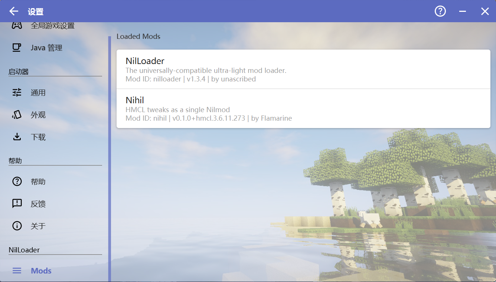

# Nihil

Better NilLoader integration and (soon) various tweaks for [HMCL](https://hmcl.huangyuhui.net/).

Currently this mod adds:
* A mod list for loaded Nilmods
* ~~ye thats all~~

### Installation

You need to first install [NilLoader](https://github.com/unascribed/NilLoader/releases).
Normally you can just download the jar and pass it as a Java agent while launching HMCL
(yet note that you will probably need to use the jar distribution of HMCL).

Then put the mod jar in the `mods` folder at the same level as the NilLoader jar.

### Screenshots

